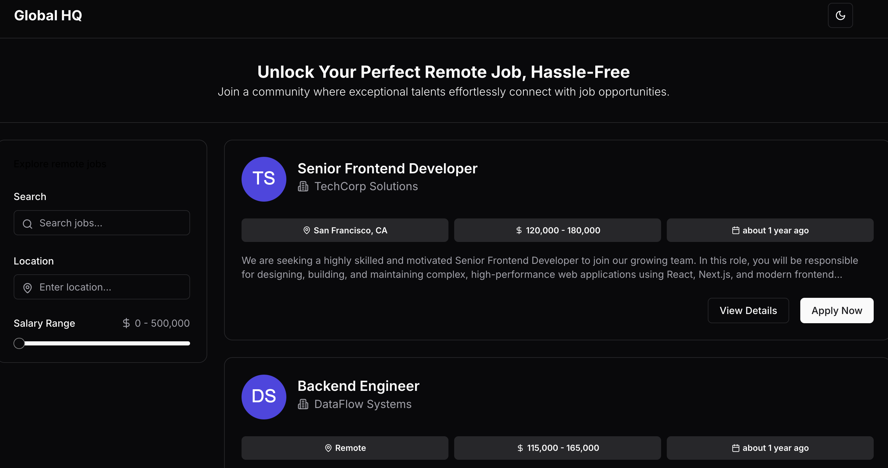
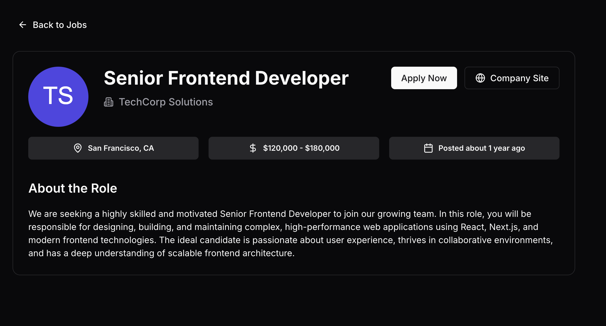

# GlobalDesk - A Job Board Application

A modern job board built with Next.js 15(Latest version), TypeScript, and Tailwind CSS. Features infinite scrolling, real-time search filtering, and a responsive design.






## Features

- 🔍 Real-time search with URL persistence
- ♾️ Infinite scrolling for job listings
- 🎨 Dark/Light mode support
- 📱 Fully responsive design
- 🔗 Shareable job listings with URL-based filters
- 💾 Job bookmarking functionality
- ⌨️ Full keyboard navigation support
- ♿ Accessible components using shadcn/ui

## Tech Stack

- Next.js 15
- TypeScript
- Tailwind CSS
- Zustand for state management
- TanStack Query
- shadcn/ui components
- nuqs for URL state management
- date-fns for date formatting

## Getting Started

### Prerequisites

- Node.js 20
- pnpm (preferred) or yarn

### Installation

1. Clone the repository:

```bash
git clone https://github.com/yourusername/job-board.git
cd job-board
```

2. Install dependencies:

```bash
pnpm install
```

3. Start the development server:

```bash
pnpm run dev
```

4. Open [http://localhost:3000](http://localhost:3000) with your browser to see the result.

## Key Features Explained

### URL-based Filtering

The application uses `nuqs` for URL state management, allowing users to share their filtered job searches:

```typescript
const [queryStates, setQueryStates] = useQueryStates({
  search: parseAsString.withDefault(''),
  location: parseAsString.withDefault(''),
  minSalary: parseAsInteger.withDefault(0),
  maxSalary: parseAsInteger.withDefault(500000),
});
```

### Infinite Scrolling

Implemented using TanStack Query and Intersection Observer:

```typescript
const { data, fetchNextPage, hasNextPage } = useJobsQuery({
  search: queryStates.search,
  // ... other filters
});
```

### State Management

Uses Zustand for global state management, particularly for saved jobs:

```typescript
export const useJobStore = create<JobStore>()(
  persist(
    (set) => ({
      savedJobs: [],
      toggleSavedJob: (jobId) => 
        set((state) => ({
          savedJobs: state.savedJobs.includes(jobId)
            ? state.savedJobs.filter((id) => id !== jobId)
            : [...state.savedJobs, jobId],
        })),
    }),
    {
      name: 'job-store',
    }
  )
);
```

## Customization

### Theme

The application uses Tailwind CSS for styling. You can customize the theme in `tailwind.config.js`:

```javascript
theme: {
  extend: {
    colors: {
      primary: { /* your colors */ },
      // ... other customizations
    },
  },
},
```

### Mock Data

You can modify the mock jobs data in `lib/data/jobs.ts` to add or modify job listings.

## Contributing

1. Fork the repository
2. Create your feature branch (`git checkout -b feature/amazing-feature`)
3. Commit your changes (`git commit -m 'Add some amazing feature'`)
4. Push to the branch (`git push origin feature/amazing-feature`)
5. Open a Pull Request

## Acknowledgments

- [shadcn/ui](https://ui.shadcn.com/) for the ui component library
- [TanStack Query](https://tanstack.com/query/latest) for data fetching
- [Zustand](https://github.com/pmndrs/zustand) for state management
